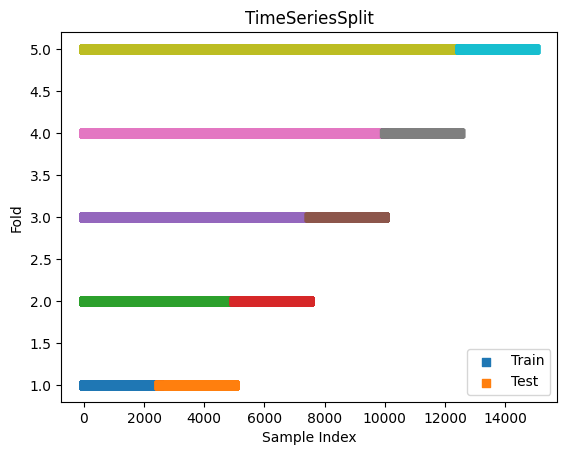
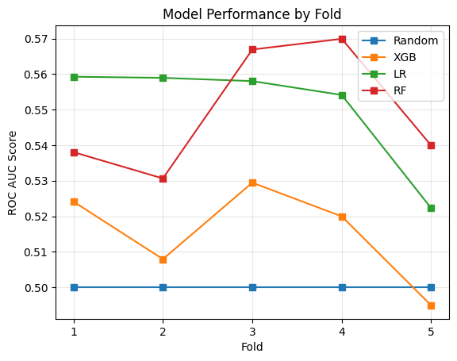
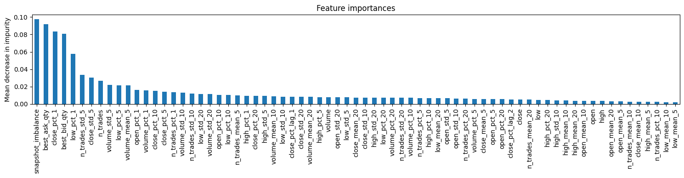

# Project Overview

This project consists of a limit order book simulation and a prediction of the 1-minute future return direction. The core components are order matching, a decision making process for the market participants and the training and evaluation loop for prediction models.

# Core Concepts
A limit order book, roughly speaking, lists the offers of market participants on a buying side (bid) and a selling side (ask). A limit order is an order of a quantity at a worst price a participant is willing to conduct an exchange. A market order on the other hand is an order to conduct an exchange of a certain quantity irrespective of the price.

The limit order book contains different price levels and associated quantities of a financial asset. The difference between the best bid price and the best ask price is called the bid/ask spread. The average of the two prices is the mid-price.

For this project the following convention will get used:
If a limit buy order arrives and is higher or equal to the best ask (selling)  price, an exchange will take place. In this exchange the best ask price will be used.
For an arriving limit sell order the limit price will need to be lower or equal to the best bid (buying) price for an exchange to occur, in which case the best bid price will be used. In both cases the price of the exchange will be either at the limit or more favourable from the perspective of the market participant who is placing the order.

More information: https://www.machow.ski/posts/2021-07-18-introduction-to-limit-order-books/

# System Architecture and Design Choices

## orders.py
`orders.py` contains the functions `match_order` and `cancel_limit_order`. 
`match_order` handles incoming limit and market orders. It takes in the details of the order (bid or ask side, limit price, quantity and the market order flag) as well as the current books (bids and asks). If the inputs are valid it sets the opposite side of the order as the book. Then, as long as the quantity is positive, it matches the order to exisisting orders in the book and continues until the quantity is no longer positive or there are no more orders in the respective book. When choosing the price of the exchange it applies the convention specified above. For each exchange the limiting quantity is the minimum of the quantity in the order or the quantity of the best book order. The function outputs a list of trades and a float of the quantity.

`cancel_limit_order` takes the same inputs as `match_order` except for the market order flag. The logic of this function is simple: For the given inputs it either removes a limit price level completely (if the removed quantity is equal to the quantity in the book) or partially. This function returns None.

## participants.py
`participants.py` contains three functions. `generate_price` defines how the limit price of a new limit order gets chosen. It takes the side, bid and ask books, a reference price and an expected change as inputs. The reference price is the last existing mid-price and the expectation is a randomly drawn value of a normal distribution with mean 0 and varying standard deviation. 
The limit price gets chosen in the following way: First, an anchor is chosen. The anchor is the best bid for buy orders and the best ask for sell orders if the respective book is not empty, otherwise it is set to the reference price. 
Then, the anchor gets multiplied with the term (1 + expectation). This introduces some randomness and can be interpreted as how aggressively an order is priced.

Then an offset is applied, either subtracted to buy orders or added to sell orders. This pushes orders away from the best price and is aimed to introduce realism. Looking at the buy order behaviour we can see that the order price gets reduced, this means there won't be an immediate trade. The same effect occurs for sell orders. The offset is drawn from a normal distribution with mean 0.05 and standard deviation 0.05 and therefore expected to be mostly positive. The return value is rounded to two decimals to prevent the book from fragmenting.

`simulate` combines the functionality to produce the order book simulation. Its inputs are the number of decisions and the random seed. The simulation starts using a fixed orderbook with a mid-price of 100.025 and orders in each book. In this function a number of decisions will randomly be made, chosen from the following options: do nothing, place a limit buy order, place a limit sell order, place a market buy order, place a market sell order, cancel a limit buy order, cancel a limit sell order or provide liquidity. 

For actions that require a quantity, one will be drawn from a half-normal distribution with mean 0 and standard deviation between 1 and 100. This was chosen to allow widely varying amounts of used quantities without too much complexity.

Cancellations are drawn randomly from the top 10 price levels of the respective book. It is assumed that participants are more likely to cancel orders near the best price.

The liquidity action simulates a market participant that quotes on both sides of the book simultaneously. Each time this action is chosen, the participant first cancels any previously placed quotes to avoid stale orders sitting at outdated prices. New quotes are then placed symmetrically around the current reference price at a fixed distance of 2 ticks (0.02) on each side. The quantity used is one fifth of the randomly drawn quantity, keeping liquidity provider order sizes smaller than those of regular participants.

`prepare_data` uses the timestamped data and generates the pandas dataframe that will serve as the starting point for the mid-price directional prediction. The function generates an open, high, low and close (OHLC) of the mid-price using pandas .ohlc(). The volume and number of trades are summed for each 1-minute interval and empty minutes are filled with 0. For the best bid and ask quantity only the most recent value for each interval is used and empty values are filled with 0. As is conventional for OHLC data, if there is no price change over an interval the last close is used for all four OHLC columns using .fillna(). bfill() handles the edge case where the first minute has no prior close to fill from.

## prediction.ipynb

The notebook runs a simulation with 150'000 decisions and the fixed seed 50 for reproducability. This generates roughly 11 days of 24-hour data. The prediction target is defined as the future 1-minute return of the mid-price close > 0.

To predict this target percentage change, rolling mean and rolling standard deviation features are generated from the OHLC, volume and number of trades columns. Multiple timeframes (1, 5, 10, 20 min) capture both short-term momentum and longer-term trends. Furthermore lagged return features are added to capture autocorrelation in returns. Additionally, an orderbook feature called "snapshot imbalance" is added. It is the ratio of the best bid quantity to the sum of the best bid and best ask quantity. Values near 1 indicate more buying pressure, whereas values near 0 indicate selling pressure.

Infinite values are replaced with NaN values, which are then forward filled to avoid gaps in the data. Finally, the target and the features are split into separate dataframes: X and y.

The training and evaluation of the models is conducted using a time-series split with an expanding training window and a fixed size testing window. Five folds are used to evaluate the performance over time. The following displays how the evaluation is structured.

Three different models are compared: XGBoost, logistic regression and Random Forest. This way both linear models with logistic regression and non-linear models with XGBoost and Random Forest are compared. The depth of the non-linear models is set to 3 to avoid overfitting. The feature data is scaled using a StandardScaler (standardization), which is fit only on training data. The evaluation metric is the ROC AUC, since classification is evaluated. A random classifier achieves a ROC AUC score of 0.5 and a higher value indicates higher predictive performance. The scores of the models are shown in the following plot. Logistic regression and Random Forest perform best on this data, scoring between around 0.52 and 0.57 ROC AUC. XGBoost mostly performs better than random apart from the 5th fold.

The following plot shows the feature importance for the random forest model. For this seed and the RF model of the last fold the features using bid quantity and ask quantity are the most important. The most recent 1-minute return of close also is quite important.

Lastly some characteristics of the data are displayed in the notebook. The data shows that there returns are mostly bound between 0.001 and -0.001, with some infrequent spikes. There also is some negative autocorrelation to past returns, indicating mean-reversion.

# Limitations and Assumptions
- The participant actions are always chosen randomly and there are no simultanious traders with different methodologies.
- While the number of choices where nothing or a trade etc. happens is random the total amount of decisions per minute is still fixed.
- The amount of data used for the model training and evaluation could be increased.
- No validation set was used to reduce the feature set. This could improve the prediction performance.
